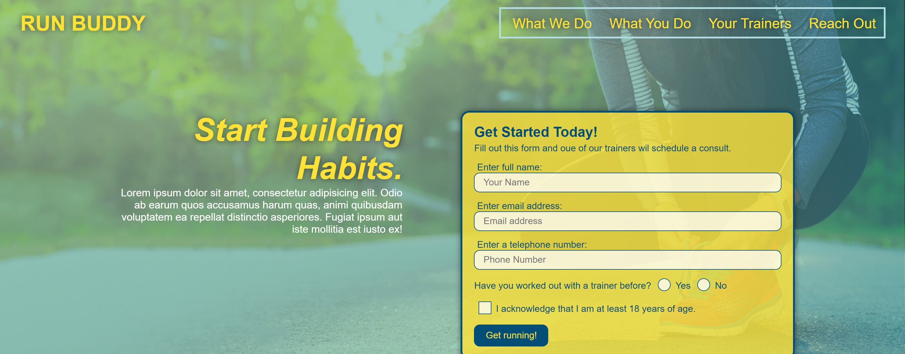

# Run Buddy

## Description
A website that offers fitness training services.

##  
## Table of Contents
* [Installation](#installation)
* [Usage](#usage)
* [License](#license)
* [Contributing](#contributing)
* [Tests](#tests)
* [Questions](#questions)

## Installation
1. Not Applicable. This is a live application and is deployed live. 

## Usage
Navigate to https://jacobryanhanson.github.io/run-buddy/. The website is interactive and user friendly so submitting forms and navigating the page is a simple as clicking the labeled buttons and links. 
### Examples
Clicking the links in the upper left corner navigates to the respective section of the page. 
 

## License
This application is covered under the ISC License.
For more information visit: http://choosealicense.com/licenses/isc

## Contributing
In reguards to contributing please refer to the Contributor Covenant.

## Tests
You could test the application by sumbitting forms and viewing the website on different platforms. 

## Questions
JacobRyanHanson (https://github.com/JacobRyanHanson) 
Email: jacobryanhanson@gmail.com
### Additional Contact Instructions
Please contact by email if necessary.
